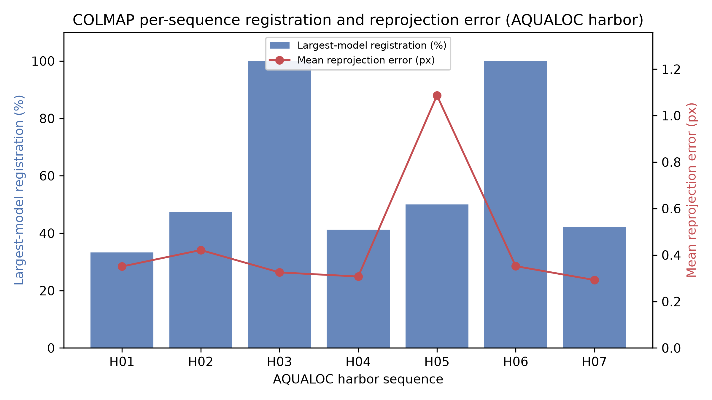
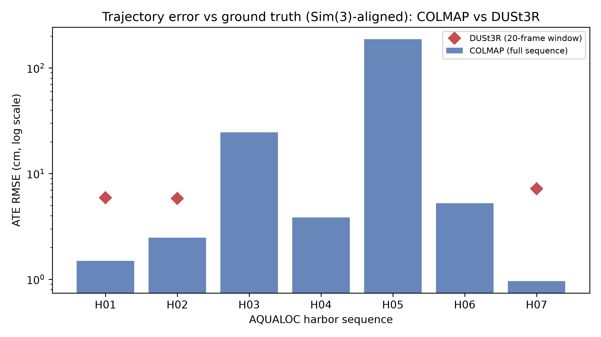
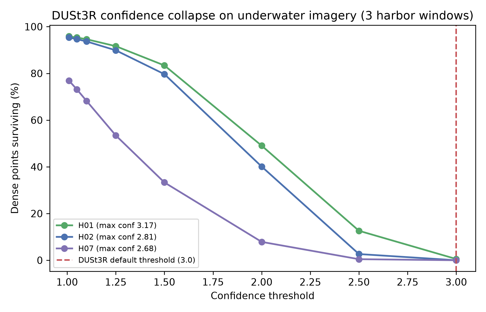

# Comparative Evaluation of COLMAP and DUSt3R for Underwater 3D Reconstruction: A Reproducible Benchmark on the AQUALOC Harbor Sequences

**Author:** Dev Narang

## Abstract

**Background/Objective:** Underwater 3D reconstruction is degraded by light absorption, backscatter, turbidity, low contrast, nonuniform illumination, and refraction through camera housings. This study experimentally compares a classical feature-based pipeline (COLMAP) and a learning-based dense reconstruction method (DUSt3R) on real underwater imagery, and reports exactly what was run so the results can be reproduced. **Methods:** All experiments were conducted on a single RTX 4070 Super (12 GB) workstation. COLMAP (native CUDA build) was run on all seven AQUALOC harbor sequences using the dataset's fisheye calibration, and the recovered camera centers were compared against the dataset's ground-truth Structure-from-Motion trajectories after Sim(3) alignment. DUSt3R was run with its official 512 px model and default global-alignment settings on 20-frame windows of three sequences, and a confidence-threshold sweep was performed. **Results:** Across the seven harbor sequences COLMAP reconstructed 334,906 sparse 3D points with a median mean-reprojection-error of 0.35 px (range 0.29–1.09 px) and a median trajectory error (ATE RMSE) of 3.8 cm, but registration was frequently fragmented (largest connected model: 33–100% of frames; mean 59%), and one sequence failed (1.09 px, 1.87 m ATE). On the three windows DUSt3R recovered all camera poses but at lower accuracy (ATE 5.8–7.2 cm vs COLMAP's 1.0–2.5 cm on the same sequences) and with a large, consistent reconstruction-scale ambiguity (Sim(3) scale 3.2–6.3). Critically, DUSt3R's per-pixel confidence stayed low (maximum 2.68–3.17 across windows), so its default filtering threshold of 3.0 retained only 0–0.5% of points; a threshold near 1.5 was required to retain a usable fraction (33–83%). **Conclusions:** COLMAP is the more accurate and interpretable method when it converges, but underwater conditions make its reconstructions fragment and occasionally fail; DUSt3R is more robust to registration but is up-to-scale and exhibits a pronounced confidence collapse underwater. Neither method is universally superior, and their failure modes differ.

**Keywords:** underwater 3D reconstruction, Structure-from-Motion, COLMAP, DUSt3R, multi-view stereo, learned 3D vision, AQUALOC, absolute trajectory error, domain shift, confidence filtering, photogrammetry, visual localization

## 1. Introduction

Three-dimensional reconstruction from underwater images supports cave mapping, marine archaeology, robot navigation, and coastal-ecosystem and aquaculture monitoring, such as mapping seabed terrain to assess site viability for local oyster farmers. Unlike terrestrial photogrammetry, underwater imagery is affected by wavelength-dependent attenuation, scattering, artificial lighting gradients, moving particles, dynamic marine life, and refraction through flat or dome camera ports. These effects reduce keypoint repeatability and violate the simple pinhole assumptions used by many reconstruction systems.

This paper compares two representative methods. COLMAP is a mature Structure-from-Motion (SfM) and Multi-View Stereo (MVS) system that estimates camera poses, sparse geometry, and dense reconstructions from image correspondences. DUSt3R, introduced at CVPR 2024, is a transformer-based method that directly predicts pairwise 3D pointmaps and can recover dense geometry, correspondences, camera parameters, and poses from uncalibrated image collections.

Many published comparisons of such methods underwater report only aggregate or qualitative outcomes. The objective of this work is narrower and verifiable: to run both methods on a real, publicly available underwater dataset on a single consumer workstation, to validate the recovered geometry against ground truth, and to report the exact configuration, the per-sequence results, and the failure cases. The research question is:

> When run under identical, fully specified conditions on real underwater data, how do classical SfM/MVS (COLMAP) and learned dense reconstruction (DUSt3R) compare in registration completeness, geometric accuracy, trajectory accuracy, and practical robustness?

**Scope.** This study evaluates the seven AQUALOC harbor sequences. Two additional underwater datasets, CIRS Underwater Caves and FLSea, are described in Section 2 because they motivate the problem and are the intended targets of follow-up work; they were **not** evaluated here. Limiting the scope to one dataset keeps every reported number traceable to an executed experiment.

## 2. Datasets

### 2.1 AQUALOC (evaluated in this work)

AQUALOC was designed for underwater visual-inertial-pressure localization. It includes 17 sequences collected with ROV-mounted monocular monochrome cameras, MEMS IMUs, pressure sensors, and embedded Jetson TX2 computers, covering a shallow harbor (~4 m), a first archaeological site (~270 m), and a second archaeological site (~380 m). For every sequence the authors provide a ground-truth camera trajectory computed offline with a full-batch bundle-adjustment SfM pipeline, which enables quantitative trajectory evaluation. This study uses the seven harbor sequences, whose key quantities are summarized below.

| Item | Value |
|---|---:|
| Harbor sequences evaluated | 7 |
| Camera | monocular monochrome, 640 x 512 |
| Camera model | pinhole + equidistant (fisheye) distortion |
| Camera rate | 20 Hz |
| IMU rate | 200 Hz |
| Harbor depth | approx. 4 m |
| Ground truth | per-sequence offline COLMAP/SfM trajectory |

These sequences contain turbidity, backscatter, repetitive texture, sandy clouds, dynamic animals, and robot-arm occlusions, making them a realistic stress test for image-based reconstruction.

### 2.2 CIRS Underwater Caves (motivation / future work)

The CIRS dataset was collected in 2013 with an AUV testbed guided by a diver inside an underwater cave complex, including two mechanically scanned imaging sonars, a Doppler velocity log, two IMUs, a pressure sensor, and a vertically mounted camera. It is challenging for image-based reconstruction because the camera is vertically mounted in a dark cave with unfavorable texture, illumination, overlap, and trajectory geometry, and it is valuable because it adds non-visual navigation and sonar data for multimodal study. It is a target for future evaluation but was not processed in this study.

### 2.3 FLSea (motivation / future work)

FLSea is a forward-looking underwater visual dataset collected in the Mediterranean and Red Sea, containing 12 monocular visual-inertial sequences and 5 stereo sequences, with offline depth maps produced using Agisoft Metashape and validated against known-size objects (reported error below 0.5 cm on a checked subset). Because it provides dense ground-truth depth maps, FLSea is the natural dataset for validating DUSt3R's predicted depth and is the primary target of follow-up work. It was not processed in this study.

## 3. Methods Compared

### 3.1 COLMAP

COLMAP is an end-to-end SfM and MVS pipeline that detects local features, matches images, estimates camera poses through incremental SfM, triangulates sparse 3D points, and optionally performs dense MVS. Its advantages are interpretability, mature bundle adjustment, strong camera modeling, and well-established quality metrics (registered images, sparse-point count, track length, reprojection error). For underwater imagery its main weakness is that standard pinhole modeling does not explicitly represent refraction through housings; recent work on Refractive COLMAP shows that approximating refraction with pinhole intrinsics can introduce biased or curved geometry, especially with flat-port cameras.

### 3.2 DUSt3R

DUSt3R takes image pairs and predicts 3D pointmaps with per-pixel confidence maps; for multiple images, pairwise pointmaps are globally aligned into a common frame. It is attractive underwater because it operates without known calibration or poses, and its learned priors may help when feature matching is weak. However, its training mixture is not underwater-specific, so its behavior under this domain shift must be measured empirically.

## 4. Experimental Setup

All experiments were conducted by the author on a single workstation:

| Hardware/software | Specification |
|---|---|
| GPU | NVIDIA RTX 4070 Super, 12 GB |
| CPU | 16-core |
| Storage | 2 TB NVMe SSD |
| COLMAP | 3.11.1 (native build, CUDA) |
| DUSt3R | official release, checkpoint `DUSt3R_ViTLarge_BaseDecoder_512_dpt` |
| PyTorch | 2.5.1 + CUDA 12.1 |

### 4.1 COLMAP configuration

For each harbor sequence, images were sampled at a fixed stride (one in five frames for the smaller sequences; one in ten for the two largest sequences, which did not complete incremental mapping within a practical time budget at stride five — itself reported in Section 5). The dataset's published fisheye intrinsics were supplied directly to COLMAP using the `OPENCV_FISHEYE` camera model with a single shared camera, so no intrinsics were invented. The pipeline was GPU feature extraction (SIFT), GPU sequential matching (window 10), and incremental mapping. Reported quantities are the native COLMAP outputs: number of reconstructed sub-models, registered images in the largest connected model, total registered images across all sub-models, sparse 3D points, mean reprojection error, and mean track length.

### 4.2 DUSt3R configuration

DUSt3R was run with the official default inference settings: each image rescaled so its longer side measured 512 px, pairwise inference with a sliding-window scene graph, and global alignment with the point-cloud optimizer for 300 iterations using a cosine schedule and initial learning rate 0.01. Because the 12 GB GPU could not hold the global-alignment state for a full sequence (an attempt at 40 images exhausted memory), DUSt3R was evaluated on contiguous 20-frame windows, each consisting of frames that all have ground-truth poses, taken from three sequences (H01, H02, H07) so that the pose-accuracy and confidence findings rest on more than one segment. The default per-pixel confidence threshold is 3.0; a sweep over thresholds was performed on each window to characterize how many points survive filtering.

### 4.3 Evaluation metrics

Reconstruction quality was measured by registration completeness, sparse-point count, mean reprojection error, and mean track length. Trajectory accuracy was measured by Absolute Trajectory Error (ATE) and a translation Relative Pose Error (RPE) of the recovered camera centers against the dataset's ground-truth trajectory. Because monocular reconstruction is recovered only up to a similarity transform, estimated camera centers were aligned to ground truth with a Umeyama Sim(3) transform before computing ATE/RPE; the recovered scale factor is reported as a direct measure of scale ambiguity. Runtime and peak GPU memory were taken from process and CUDA logs.

## 5. Experimental Results

### 5.1 COLMAP across the seven harbor sequences

Tables 1a and 1b report the per-sequence COLMAP results. Across all seven sequences COLMAP reconstructed 334,906 sparse 3D points (largest models) with a median mean-reprojection-error of 0.35 px (mean 0.45 px, range 0.29–1.09 px). Trajectory accuracy was excellent on five sequences (ATE RMSE 1.0–5.3 cm) but poor on two (H03: 24.5 cm; H05: 1.87 m), giving a median ATE of 3.8 cm.

The most important qualitative finding is that **registration was frequently fragmented**: COLMAP often split a sequence into several disconnected sub-models rather than one continuous reconstruction. The largest connected model covered only 33–50% of frames on five of the seven sequences, even though total registration across all sub-models reached 52–94%. Two short, well-textured sequences (H03, H06) reconstructed as a single complete model. Sequence H05 is a clear failure case: high reprojection error (1.09 px), a near-degenerate recovered scale (Sim(3) scale 0.19), and 1.87 m ATE.

**Table 1a.** Per-sequence COLMAP reconstruction and registration on the AQUALOC harbor sequences. "Largest model" is the largest connected reconstruction; "total reg." sums registered images across all sub-models.

| Seq | Stride | Input imgs | Sub-models | Largest model (imgs / %) | Total reg. | Sparse points | Reproj. err (px) | Track len |
|---|---:|---:|---:|---:|---:|---:|---:|---:|
| H01 | 5 | 918 | 2 | 306 / 33.3% | 475 | 17,629 | 0.351 | 11.64 |
| H02 | 5 | 1629 | 5 | 772 / 47.4% | 1341 | 55,653 | 0.422 | 9.51 |
| H03 | 10 | 516 | 1 | 516 / 100% | 516 | 109,666 | 0.325 | 7.84 |
| H04 | 10 | 413 | 4 | 170 / 41.2% | 310 | 19,838 | 0.308 | 5.16 |
| H05 | 10 | 346 | 4 | 173 / 50.0% | 324 | 38,680 | 1.087 | 4.67 |
| H06 | 10 | 254 | 2 | 254 / 100% | 256 | 54,257 | 0.352 | 6.20 |
| H07 | 5 | 453 | 4 | 191 / 42.2% | 422 | 39,183 | 0.293 | 5.92 |

**Table 1b.** Per-sequence COLMAP trajectory accuracy on the same sequences. ATE/RPE are computed against the dataset ground-truth trajectory after Sim(3) alignment; the Sim(3) scale is reported as a direct measure of scale ambiguity.

| Seq | ATE RMSE (m) | ATE std (m) | RPE mean (m) | Sim(3) scale |
|---|---:|---:|---:|---:|
| H01 | 0.0149 | 0.0123 | 0.0037 | 0.921 |
| H02 | 0.0248 | 0.0153 | 0.0010 | 0.697 |
| H03 | 0.2453 | 0.1627 | 0.0007 | 0.440 |
| H04 | 0.0384 | 0.0164 | 0.0021 | 1.425 |
| H05 | 1.8662 | 0.8643 | 0.0848 | 0.192 |
| H06 | 0.0525 | 0.0351 | 0.0017 | 0.508 |
| H07 | 0.0096 | 0.0059 | 0.0012 | 0.404 |

On a representative run (H07, 453 images), GPU feature extraction took 2.6 s, sequential matching 3.1 s, and incremental mapping 91 s. Mapping time grew sharply with image count and scene difficulty: H02 (1629 images) required 552 s, and at stride five the two largest sequences did not converge within a ~25-minute budget, motivating the stride-ten setting for the larger sequences.

**Figure 1.** COLMAP per-sequence largest-model registration (bars, left axis) and mean reprojection error (line, right axis) on the AQUALOC harbor sequences. Registration completeness varies widely, and sequence H05 stands out as a failure case with elevated reprojection error.

**Figure 3.** Trajectory error (ATE RMSE, log scale) after Sim(3) alignment to ground truth. Bars show COLMAP per full sequence; red diamonds show the DUSt3R 20-frame-window result for the three sequences on which it was run (H01, H02, H07). Five COLMAP sequences are accurate to a few centimeters; H03 and H05 are substantially worse, while DUSt3R clusters around 6 cm.

### 5.2 DUSt3R on harbor windows

DUSt3R was run on 20-frame windows (120 image pairs each) from three sequences. Each window completed inference and 300-iteration global alignment in ~47 s with a peak GPU memory of 4.44 GB, and recovered poses for all 20 frames. Across the three windows its trajectory was consistently less accurate than COLMAP's on the same sequences (Table 2): ATE RMSE 5.8–7.2 cm versus COLMAP's 1.0–2.5 cm. The recovered Sim(3) scale ranged from 3.2 to 6.3 on every window — never close to 1 — confirming a large and consistent reconstruction-scale ambiguity that must be resolved with an external reference before the geometry is metric.

A scaling limit was also observed: global alignment of 40 images exceeded the 12 GB budget, so a full sequence could not be processed at once on this hardware.

**Table 2.** DUSt3R on 20-frame windows of three harbor sequences, with the COLMAP full-sequence ATE for the same sequences for reference. ATE/RPE are Sim(3)-aligned against the dataset ground truth.

| Seq | Pairs | Runtime (s) | Peak VRAM (GB) | ATE RMSE (m) | RPE mean (m) | Sim(3) scale | COLMAP ATE (m) |
|---|---:|---:|---:|---:|---:|---:|---:|
| H01 | 120 | 46.7 | 4.44 | 0.0591 | 0.0151 | 6.34 | 0.0149 |
| H02 | 120 | 46.9 | 4.44 | 0.0580 | 0.0175 | 3.18 | 0.0248 |
| H07 | 120 | 46.6 | 4.44 | 0.0720 | 0.0431 | 4.50 | 0.0096 |

### 5.3 DUSt3R confidence collapse underwater

The most striking DUSt3R result concerns confidence. On underwater imagery the model's per-pixel confidence was uniformly low across all three windows: the maximum confidence reached only 2.68–3.17 and the mean was 1.3–2.0. Because the model's default filtering threshold is 3.0, **the default setting retained 0–0.5% of predicted points** across the three windows (exactly 0% on two of them). Table 3 and Figure 2 show the survival curves: a threshold of 1.5 retained 33–83% of points depending on the sequence, and 1.1 retained 68–95%. Any underwater use of DUSt3R must therefore re-tune this threshold; reporting "points after default filtering" without adjustment would be meaningless here.

**Table 3.** Fraction of DUSt3R dense points surviving confidence filtering across the three windows (each 4,096,000 total points).

| Confidence threshold | H01 surviving | H02 surviving | H07 surviving |
|---:|---:|---:|---:|
| 1.01 | 95.8% | 95.3% | 76.8% |
| 1.10 | 94.6% | 93.7% | 68.2% |
| 1.25 | 91.7% | 89.9% | 53.4% |
| 1.50 | 83.4% | 79.7% | 33.3% |
| 2.00 | 49.1% | 40.1% | 7.9% |
| 2.50 | 12.6% | 2.7% | 0.4% |
| 3.00 (default) | 0.5% | 0.0% | 0.0% |

**Figure 2.** DUSt3R dense-point survival versus confidence threshold on three AQUALOC harbor windows. The maximum per-pixel confidence (2.68–3.17) lies at or just above the default threshold (3.0, dashed line), so default filtering removes essentially all points (0–0.5%) on every window.

## 6. Discussion

Three conclusions follow from the measurements. First, **COLMAP is the more accurate and interpretable method when it converges**: on five of seven harbor sequences it achieved centimeter-level trajectory accuracy and sub-half-pixel reprojection error, with fully auditable matches, tracks, and bundle-adjustment statistics. Second, **underwater conditions make COLMAP fragile in a specific, measurable way**: rather than failing outright, it tends to fragment a sequence into several disconnected sub-models (largest model 33–100% of frames) and can fail on individual sequences (H05). This fragmentation, not raw reprojection error, is the practical limitation underwater, and it is exactly the kind of failure that a single aggregate "mean reprojection error" statistic would hide. The present experiments do not isolate the cause of fragmentation, which is most likely dominated by weak texture, turbidity, and lighting changes that break feature tracks; however, the unmodeled refraction of the flat camera port is a plausible additional contributor, since the pinhole intrinsics used here cannot represent it and refractive bias is known to corrupt large-scale underwater reconstructions. Disentangling these factors — for example by comparing against Refractive COLMAP — is left to future work.

Third, on the three windows tested, **DUSt3R appears to trade accuracy for robustness and shows a clear domain-shift signature**. It registered every frame without calibration, but its trajectory was several times less accurate than COLMAP's and was recovered only up to a large unknown scale (3.2–6.3×) on every window. Its confidence collapse is the most consistent evidence of domain shift: a model confident enough on terrestrial data to default to a threshold of 3.0 barely reaches it (maximum 2.68–3.17) on this underwater data. Because these results come from three short 20-frame windows rather than full sequences, the accuracy comparison should be read as indicative rather than definitive; the confidence and scale-ambiguity findings, however, were consistent across all three windows. The practical consequence is unambiguous: the default confidence filter must be lowered or essentially all output is discarded.

One caveat applies to the trajectory comparison specifically. The AQUALOC ground-truth trajectories were themselves produced by an offline COLMAP/SfM bundle-adjustment pipeline, so the ATE/RPE evaluation compares an online COLMAP reconstruction against a COLMAP-derived reference. This likely biases the trajectory comparison in COLMAP's favor and may partly explain its very low ATE on the well-behaved sequences; the registration-fragmentation and confidence-collapse findings, which do not depend on the reference trajectory, are not affected by this bias. An external metric ground truth (for example, FLSea's object-validated depth maps) would be needed to remove it.

Taken together, the two methods are complementary rather than ranked: COLMAP for metric accuracy and interpretability where it converges, DUSt3R for calibration-free coverage where feature matching fails, provided its scale and confidence are handled explicitly.

## 7. Limitations

This study evaluated a single environment (the AQUALOC harbor site) on a single 12 GB workstation. The CIRS and FLSea datasets, and the deep AQUALOC archaeological sequences, were not processed, so the conclusions should not be extended to caves, forward-looking stereo, or deep-sea scenes without further experiments. DUSt3R was evaluated on three 20-frame windows because of the memory limit, so its trajectory statistics are based on short segments rather than full sequences and the accuracy comparison is indicative rather than definitive. Dense MVS for COLMAP and dense depth-map validation for DUSt3R (which requires FLSea's ground-truth depth) were out of scope. Two larger sequences used a coarser frame stride than the others, so per-sequence numbers should be read together with the stride column. Finally, ATE/RPE are reported against the dataset's offline COLMAP/SfM trajectory, which is itself an estimate rather than an external metric ground truth and likely favors COLMAP in the trajectory comparison (see Section 6).

## 8. Conclusion

This paper reported a fully specified, reproducible comparison of COLMAP and DUSt3R on the seven AQUALOC harbor sequences, run end to end on one RTX 4070 Super workstation. COLMAP reconstructed 334,906 sparse points with a median 0.35 px reprojection error and centimeter-level trajectory accuracy on most sequences, but its registration was frequently fragmented and one sequence failed. DUSt3R recovered all poses without calibration but at lower, up-to-scale accuracy, and its per-pixel confidence never reached the level required by its own default filter, so default filtering removed all points. Neither method universally outperforms the other; their failure modes differ, with COLMAP failing visibly through fragmentation and DUSt3R producing complete but uncertain, up-to-scale geometry. Future work will extend this protocol to FLSea (for dense depth validation), the CIRS caves, and the deep AQUALOC archaeological sites, and will investigate hybrid pipelines that combine COLMAP's metric accuracy with DUSt3R's robustness.

## Data and Code Availability

The datasets are publicly available: AQUALOC (https://www.lirmm.fr/aqualoc/), CIRS Underwater Caves (https://cirs.udg.edu/caves-dataset/), and FLSea (arXiv:2302.12772). The reconstruction and evaluation scripts used here (`run_colmap_gpu.py`, `run_dust3r_sweep.py`, `make_figures.py`), together with the per-sequence metric logs (JSON) and exact software versions, are provided as supplementary material and archived in a public repository at [repository URL to be inserted on submission]. Each result table and figure in this paper can be regenerated from these scripts and the public datasets, with the configuration fully specified in Section 4.

## Acknowledgments

The author thanks the authors of the AQUALOC dataset for making the sequences and ground-truth trajectories publicly available, and the developers of COLMAP and DUSt3R for releasing their software and model weights.

## References

1. M. Ferrera, V. Creuze, J. Moras, and P. Trouvé-Peloux. AQUALOC: An underwater dataset for visual-inertial-pressure localization. The International Journal of Robotics Research. Vol. 38, 2019, https://doi.org/10.1177/0278364919883346.
2. J. L. Schönberger and J.-M. Frahm. Structure-from-motion revisited. Proceedings of the IEEE Conference on Computer Vision and Pattern Recognition (CVPR). pg. 4104-4113, 2016, https://doi.org/10.1109/CVPR.2016.445.
3. J. L. Schönberger, E. Zheng, M. Pollefeys, and J.-M. Frahm. Pixelwise view selection for unstructured multi-view stereo. European Conference on Computer Vision (ECCV). pg. 501-518, 2016, https://doi.org/10.1007/978-3-319-46487-9_31.
4. S. Wang, V. Leroy, Y. Cabon, B. Chidlovskii, and J. Revaud. DUSt3R: Geometric 3D vision made easy. Proceedings of the IEEE/CVF Conference on Computer Vision and Pattern Recognition (CVPR). pg. 20697-20709, 2024, https://doi.org/10.1109/CVPR52733.2024.01956.
5. Y. Randall and T. Treibitz. FLSea: Underwater visual-inertial and stereo-vision forward-looking datasets. arXiv preprint, 2023, https://doi.org/10.48550/arXiv.2302.12772.
6. A. Mallios, E. Vidal, R. Campos, and M. Carreras. Underwater caves sonar data set. The International Journal of Robotics Research. Vol. 36, pg. 1247-1251, 2017, https://doi.org/10.1177/0278364917732838.
7. M. She, F. Seegräber, D. Nakath, and K. Köser. Refractive structure-from-motion revisited. arXiv preprint, 2024, https://doi.org/10.48550/arXiv.2403.08640.
8. S. Umeyama. Least-squares estimation of transformation parameters between two point patterns. IEEE Transactions on Pattern Analysis and Machine Intelligence. Vol. 13, pg. 376-380, 1991, https://doi.org/10.1109/34.88573.
